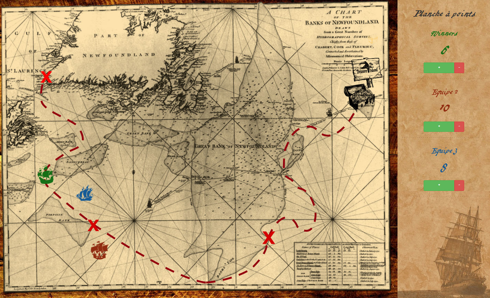

Christmas pirate race
=====================

Display teams scores through an exciting pirates boats race.
Project created for the Darkmira Xmas blind-test event.



Developed by [Darkmira](http://www.darkmira.fr/).


### Prerequisites

- Browser compatible with css3 ([use filter property, see compatibility](http://caniuse.com/#feat=css-filters))
- A saber and brave crews to board your ship


## Using

Simply open index.html in your browser, and start to count points to each team
by clicking + or - in the menu.

Boats will then navigate to the treasure.


### Features

- Add or remove point to teams
- Change team name


### Advanced usage

- Add or remove boats by changing `Config.boatsNumber` in model.js, and uncommenting UI items in index.html

- Invoke Poseidon to create more or less waves:

``` js
Poseidon.createWaves(32);
```


## License

This project in under GNU License.

[See complete License here](LICENSE)
